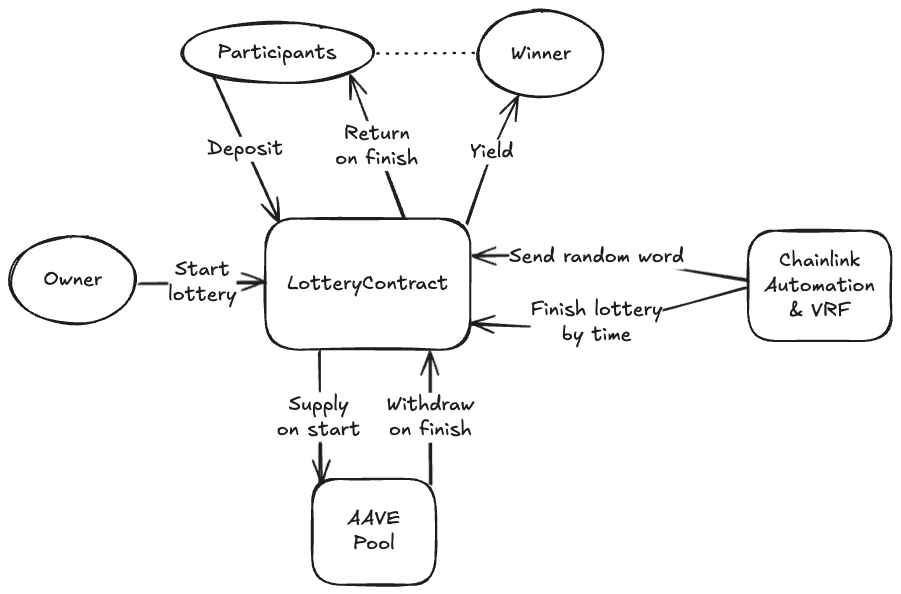

# CK Blockchain Project

## Project Overview

This repository contains a blockchain-based lottery contract implementation.

## Architecture Diagram

Below is the architectural scheme of the project:



## Project Structure

- `src/`: Contains the smart contract source code
  - `LotteryContract.sol`: Main lottery contract implementation
  - `LotteryStorage.sol`: Storage contract for the lottery
- `script/`: Contains deployment scripts
- `test/`: Contains test files for the contracts
- `lib/`: External dependencies

## Getting Started

This project uses Foundry for development and testing. Follow the instructions below to get started.

### Prerequisites

- Foundry

### Installation

```bash
git clone <repository-url>
cd project1
forge install
```

### Testing

```bash
forge test
```

### Deployment

```bash
forge script script/LotteryContractDeploy.s.sol
```
